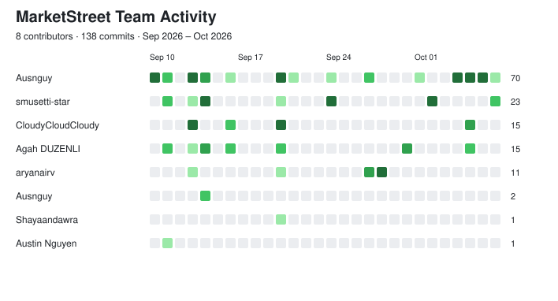

  

MarketStreet is a simulated stock trading application that allows users to place and track paper-trading transactions without using real money.

## Project Scenario

Many beginner investors want to practice trading and understand how stock transactions work without risking real money. MarketStreet provides a simplified environment where users can submit simulated stock trades and track the resulting transaction status.

## Main Transaction

The primary transaction is:

> **A user submits a simulated stock trade order.**

The system validates the transaction, applies applicable business rules, records the trade request, and returns a transaction status.

## System Design

[Browse the system design documents](docs/03-system-design/README.md) for the architecture, workflow, trade states, field definitions, and tier responsibilities.

## Project Purpose

The purpose of this project is to demonstrate the complete processing of a stock trading transaction from user input through validation, business rules, system processing, and record creation.

## Project Activity

## Team Members

- Austin Nguyen
- Sophia Musetti
- Arya Nair
- Benjamin Nguyen
- Shayaan M. Dawra
- Agah Duzenli
