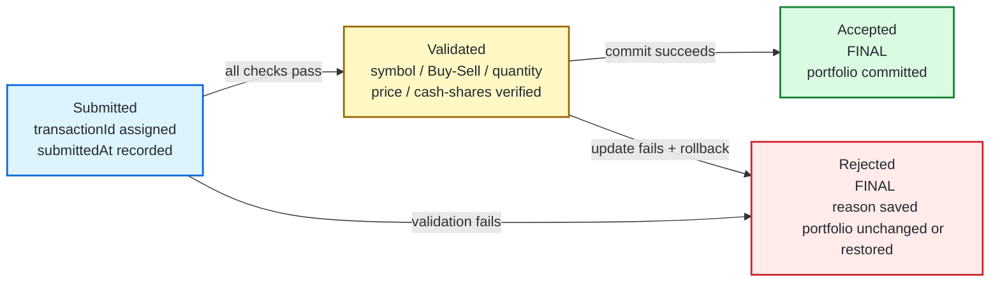

```mermaid
flowchart LR
    S["Submitted
    transactionId assigned
    submittedAt recorded"]

    V["Validated
    symbol / Buy-Sell / quantity
    price / cash-shares verified"]

    A["Accepted
    FINAL
    portfolio committed"]

    R["Rejected
    FINAL
    reason saved
    portfolio unchanged or restored"]

    S -- "all checks pass" --> V
    S -- "validation fails" --> R
    V -- "commit succeeds" --> A
    V -- "update fails + rollback" --> R

    classDef submitted fill:#ddf4ff,stroke:#0969DA,color:#24292f,stroke-width:2px
    classDef validated fill:#fff8c5,stroke:#9a6700,color:#24292f,stroke-width:2px
    classDef accepted fill:#dafbe1,stroke:#1a7f37,color:#24292f,stroke-width:2px
    classDef rejected fill:#ffebe9,stroke:#cf222e,color:#24292f,stroke-width:2px

    class S submitted
    class V validated
    class A accepted
    class R rejected
```
