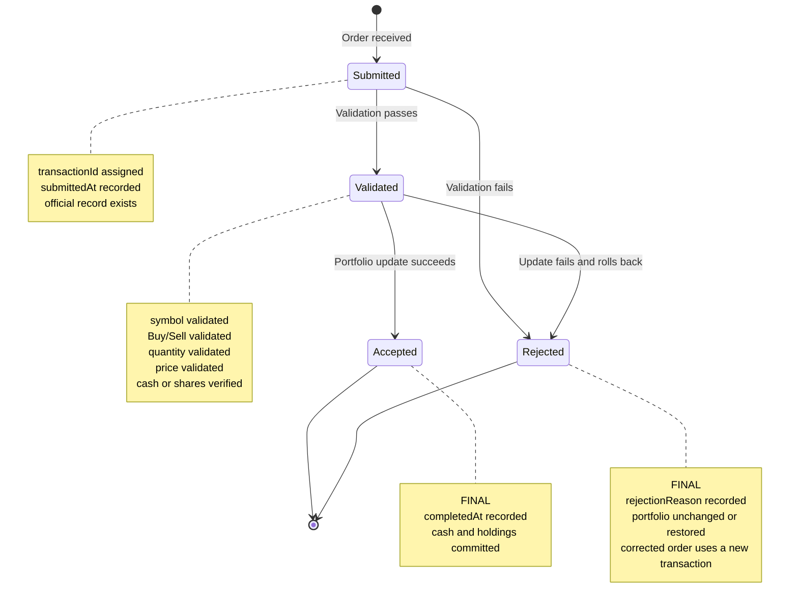

# MarketStreet — State Transition Diagram

```mermaid
stateDiagram-v2
    [*] --> Submitted: Order received

    Submitted --> Validated: Validation passes
    Submitted --> Rejected: Validation fails

    Validated --> Accepted: Portfolio update succeeds
    Validated --> Rejected: Update fails and rolls back

    Accepted --> [*]
    Rejected --> [*]

    note right of Submitted
      transactionId assigned
      submittedAt recorded
      official record exists
    end note

    note right of Validated
      symbol validated
      Buy/Sell validated
      quantity validated
      price validated
      cash or shares verified
    end note

    note right of Accepted
      FINAL
      completedAt recorded
      cash and holdings committed
    end note

    note right of Rejected
      FINAL
      rejectionReason recorded
      portfolio unchanged or restored
      corrected order uses a new transaction
    end note
```
