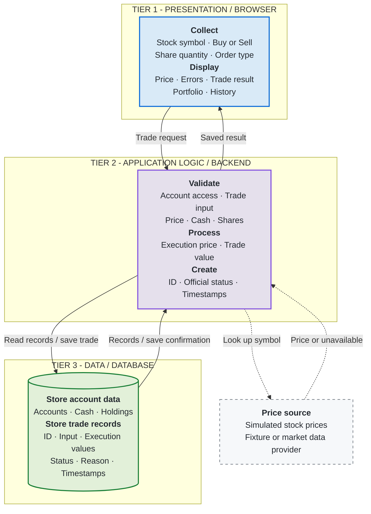

# MarketStreet - Three-Tier Architecture

**Presentation collects and displays. Application logic validates and decides. Data stores the official records.**

Only the application accesses the database. The price source supplies the application with prices; it is a dependency outside the three tier boxes.

**Implementation status:** This is the proposed architecture. The [current prototype](../../Testing/Trade-UI/trade-ui.js) runs in the browser; the backend and persistent database are planned.

Details: [Trade workflow](workflow-v1.md) · [Data dictionary](data-dictionary.md) · [Trade states](state-diagram.md) · [Responsibility notes](short-responsibility-notes.md).
