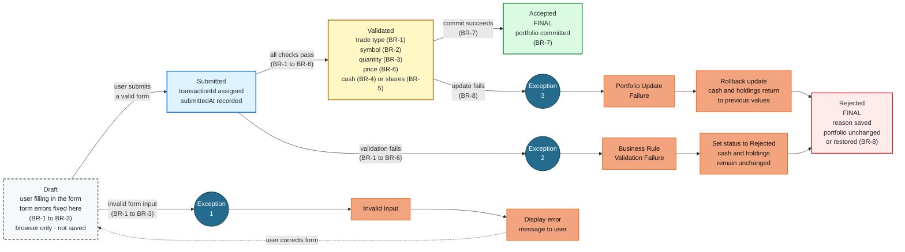

# MarketStreet — State Transition Diagram

## Business Rules

| Rule | Meaning | Where it appears |
|---|---|---|
| BR-1 | Trade type must be Buy or Sell | Draft / Exception 1, Submitted → Validated / Exception 2 |
| BR-2 | Stock symbol must be recognized | Draft / Exception 1, Submitted → Validated / Exception 2 |
| BR-3 | Share quantity must be a positive whole number | Draft / Exception 1, Submitted → Validated / Exception 2 |
| BR-4 | Enough simulated cash is required for a Buy | Submitted → Validated / Exception 2 |
| BR-5 | Enough shares must be owned for a Sell | Submitted → Validated / Exception 2 |
| BR-6 | A valid stock price is required | Submitted → Validated / Exception 2 |
| BR-7 | Accepted trades update cash and holdings | Validated → Accepted |
| BR-8 | Rejected trades change nothing; a failed portfolio update is rolled back | Exception 2 / Exception 3 → Rejected |

Rule numbers match [business-rules.md](../../docs/02-requirements/business-rules.md).

## Exception / Failure Paths

| Exception | Occurs At | Trigger | Result |
|---|---|---|---|
| **Exception 1 — Invalid Input** | **Draft** | The user enters invalid form data covered by BR-1 to BR-3. | Display an error message. The user remains in **Draft** until the form is corrected. Nothing is saved. |
| **Exception 2 — Business Rule Validation Failure** | **Submitted** | The submitted trade fails application validation under BR-1 to BR-6. | Set the transaction status to **Rejected**. Cash and holdings remain unchanged. |
| **Exception 3 — Portfolio Update Failure** | **Validated** | An error occurs while committing the validated trade to the portfolio. | Roll back the attempted update, restore the previous cash and holdings values, and set the transaction status to **Rejected**. |

**Exception 1** occurs before a transaction record exists. The user corrects the form and remains in the **Draft** state.

**Exception 2** occurs after submission when the trade fails application-level validation. The transaction is saved as **Rejected**, but no portfolio values are changed.

**Exception 3** occurs after validation when the portfolio update fails. Any partial update is rolled back before the transaction is saved as **Rejected**.

Both application-side failure paths converge on the same final **Rejected** state.

## States

| State | Where it lives | Saved? | Final? |
|---|---|---|---|
| **Draft** | Browser | No — no record and no transactionId | No |
| **Submitted** | Application | Yes | No |
| **Validated** | Application | Yes | No |
| **Accepted** | Application | Yes | Yes |
| **Rejected** | Application | Yes, with the rejection reason | Yes |

**Draft** represents the user's unsent order form. Its dashed border shows that it exists only in the browser and is not saved.

Form errors covered by BR-1 to BR-3 trigger **Exception 1** and keep the user in Draft until the form is corrected.

After submission, the application re-checks BR-1 to BR-3 because browser-side validation can be bypassed. It also evaluates BR-4 to BR-6 using application data.

If all validation checks pass, the transaction moves from **Submitted** to **Validated**.

If validation fails, **Exception 2** moves the transaction to **Rejected** without changing cash or holdings.

If validation succeeds and the portfolio update succeeds, the transaction moves to **Accepted**.

If the portfolio update fails, **Exception 3** rolls back the attempted changes and moves the transaction to **Rejected**.