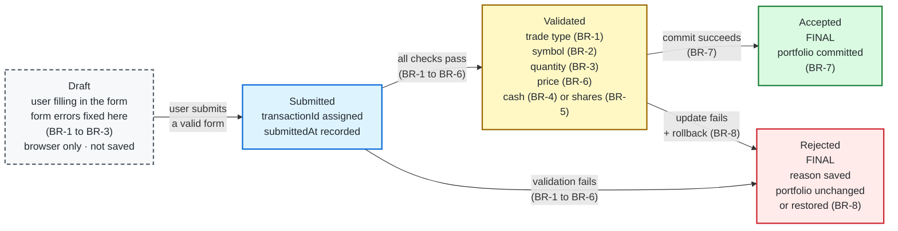
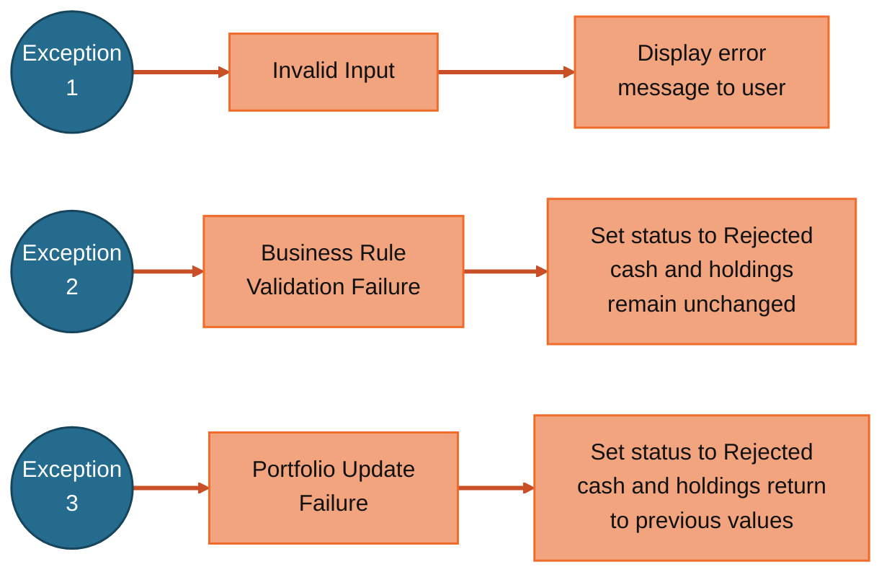

# MarketStreet — State Transition Diagram

## Exception / Failure Paths

The following paths show how MarketStreet handles errors that interrupt the normal transaction flow. Exception 1 occurs before a transaction record exists. Exceptions 2 and 3 occur after submission and result in the transaction entering the **Rejected** state.

| Exception | Happens at | Trigger | Result |
|---|---|---|---|
| **Exception 1 — Invalid Input** | **Draft** | The user enters invalid form data, such as an invalid trade type, stock symbol, or quantity (BR-1 to BR-3). | Display an error message. The order remains in **Draft** and nothing is saved. |
| **Exception 2 — Business Rule Validation Failure** | **Submitted → Rejected** | The application rejects the submitted trade during validation (BR-1 to BR-6), such as insufficient cash, insufficient shares, or an invalid stock price. | Set the transaction status to **Rejected**. Cash and holdings remain unchanged. |
| **Exception 3 — Portfolio Update Failure** | **Validated → Rejected** | An error occurs while committing the validated trade to the portfolio (BR-7 / BR-8). | Roll back the attempted update, set the transaction status to **Rejected**, and restore cash and holdings to their previous values. |

## States

| State | Where it lives | Saved? | Final? |
|---|---|---|---|
| **Draft** | Browser (the user's unsent order form) | No — no record, no transactionId | No |
| **Submitted** | Application | Yes | No |
| **Validated** | Application | Yes | No |
| **Accepted** | Application | Yes | Yes |
| **Rejected** | Application | Yes, with the reason | Yes |

**Draft** has a dashed border because it exists only in the browser. Form errors (BR-1 to BR-3) keep the order in Draft until the user fixes them, so nothing is saved. Once the user submits, the application re-checks BR-1 to BR-3 because browser checks can be bypassed, and checks BR-4 to BR-6, which require application data.

## Business Rules on this Diagram

| Rule | Meaning | Where it appears |
|---|---|---|
| BR-1 | Trade type must be Buy or Sell | Draft (browser check), Submitted → Validated / Rejected |
| BR-2 | Stock symbol must be recognized | Draft (browser check), Submitted → Validated / Rejected |
| BR-3 | Share quantity must be a positive whole number | Draft (browser check), Submitted → Validated / Rejected |
| BR-4 | Enough simulated cash for a Buy | Submitted → Validated / Rejected |
| BR-5 | Enough shares owned for a Sell | Submitted → Validated / Rejected |
| BR-6 | A valid stock price is required | Submitted → Validated / Rejected |
| BR-7 | Accepted trades update cash and holdings | Validated → Accepted |
| BR-8 | Rejected trades change nothing; a failed update is rolled back | Submitted / Validated → Rejected |

Rule numbers match [business-rules.md](../../docs/02-requirements/business-rules.md).