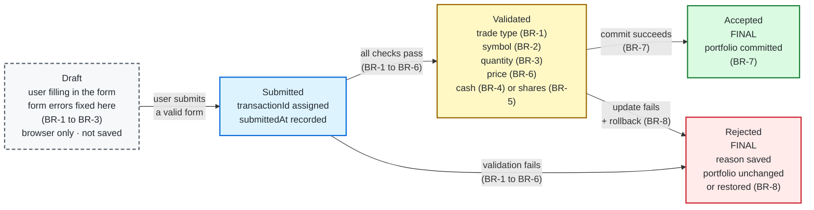

# MarketStreet — State Transition Diagram

## States

| State | Where it lives | Saved? | Final? |
|---|---|---|---|
| **Draft** | Browser (the user's unsent order form) | No — no record, no transactionId | No |
| **Submitted** | Application | Yes | No |
| **Validated** | Application | Yes | No |
| **Accepted** | Application | Yes | Yes |
| **Rejected** | Application | Yes, with the reason | Yes |

**Draft** has a dashed border because it exists only in the browser. Form errors (BR-1 to BR-3) keep the order in Draft until the user fixes them, so nothing is saved. Once the user submits, the application re-checks BR-1 to BR-3 (browser checks can be bypassed) and checks BR-4 to BR-6, which only the application can verify.

## Business rules on this diagram

| Rule | Meaning | Where it appears |
|---|---|---|
| BR-1 | Trade type must be Buy or Sell | Draft (browser check), Submitted → Validated / Rejected |
| BR-2 | Stock symbol must be recognized | Draft (browser check), Submitted → Validated / Rejected |
| BR-3 | Share quantity must be a positive whole number | Draft (browser check), Submitted → Validated / Rejected |
| BR-4 | Enough simulated cash for a Buy | Submitted → Validated / Rejected |
| BR-5 | Enough shares owned for a Sell | Submitted → Validated / Rejected |
| BR-6 | A valid stock price is required | Submitted → Validated / Rejected |
| BR-7 | Accepted trades update cash and holdings | Validated → Accepted |
| BR-8 | Rejected trades change nothing; a failed update is rolled back | Submitted / Validated → Rejected |

Rule numbers match [business-rules.md](../../docs/02-requirements/business-rules.md).
