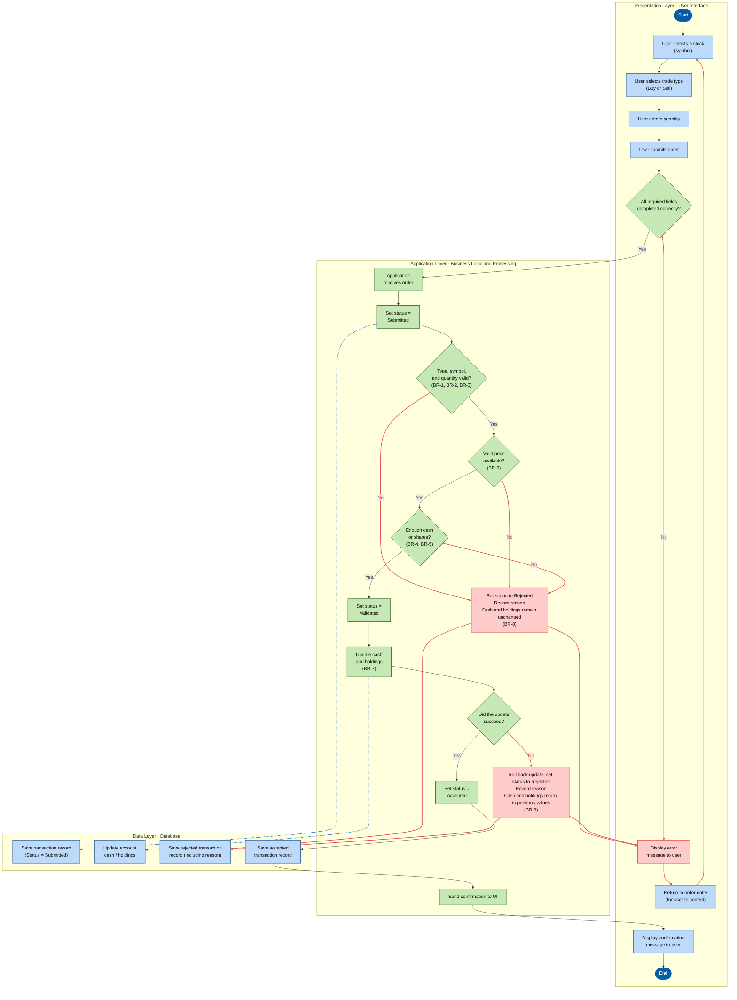

# MarketStreet — Stock Trade Order Workflow

**Main transaction:** User submits a simulated stock trade order.

## Legend

| Shape / Line | Meaning |
|---|---|
| Dark blue rounded box | Start / End |
| Blue rectangle | Presentation or Data process / action |
| Green rectangle | Application process / action |
| Green diamond | Decision |
| Solid arrow | Normal flow |
| Red arrow | Rejection / error flow |
| Blue dashed arrow | Database write |

## Business Rules

| Rule | Meaning |
|---|---|
| BR-1 | Trade type is Buy or Sell. |
| BR-2 | Stock symbol is recognized. |
| BR-3 | Quantity is a positive whole number. |
| BR-4 | Buy orders have enough cash to cover the trade. |
| BR-5 | Sell orders have enough shares owned. |
| BR-6 | A valid stock price is available. |
| BR-7 | Accepted trades update cash and holdings. |
| BR-8 | Rejected trades leave cash and holdings unchanged; failed updates are rolled back to previous values. |

**Save rule:** Cash, holdings, and the Accepted record are committed together before confirmation is shown.

Details: [Business rules](../02-requirements/business-rules.md) · [Trade states and exception paths](state-diagram.md) · [Three-tier architecture](architecture.md) · [Data dictionary](data-dictionary.md).
